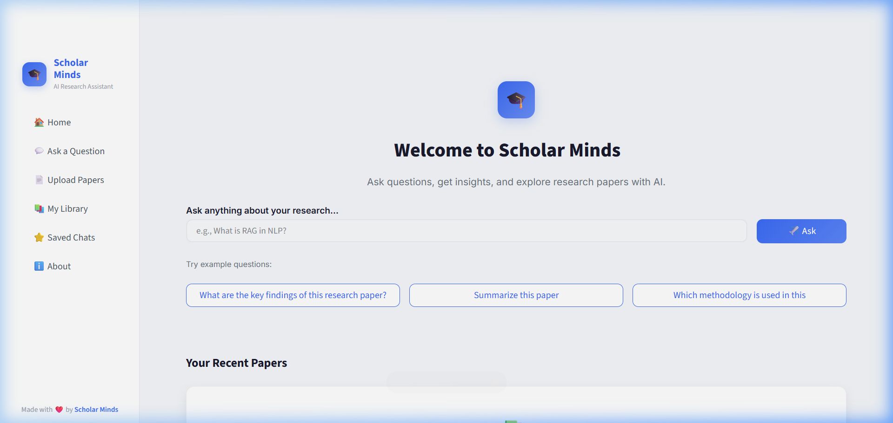
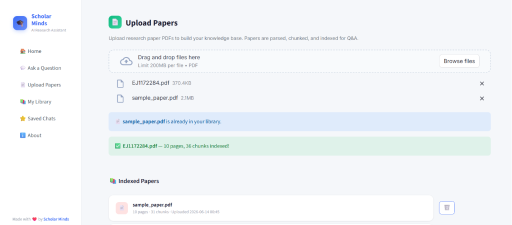
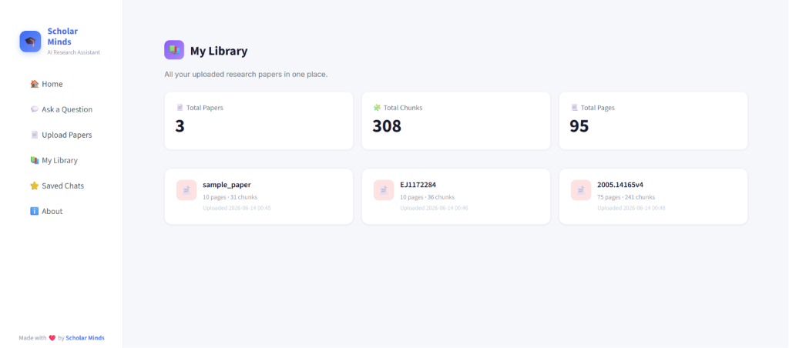
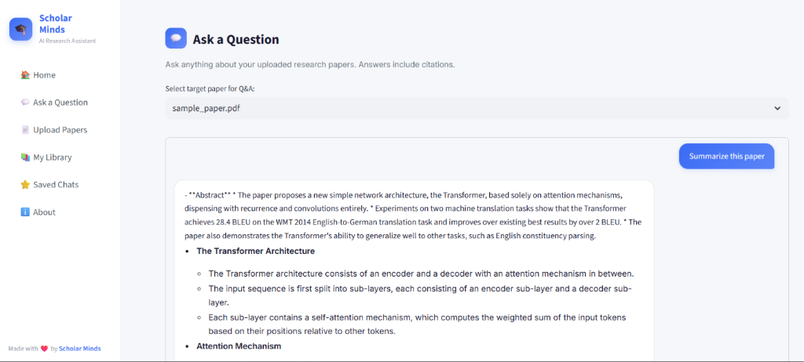
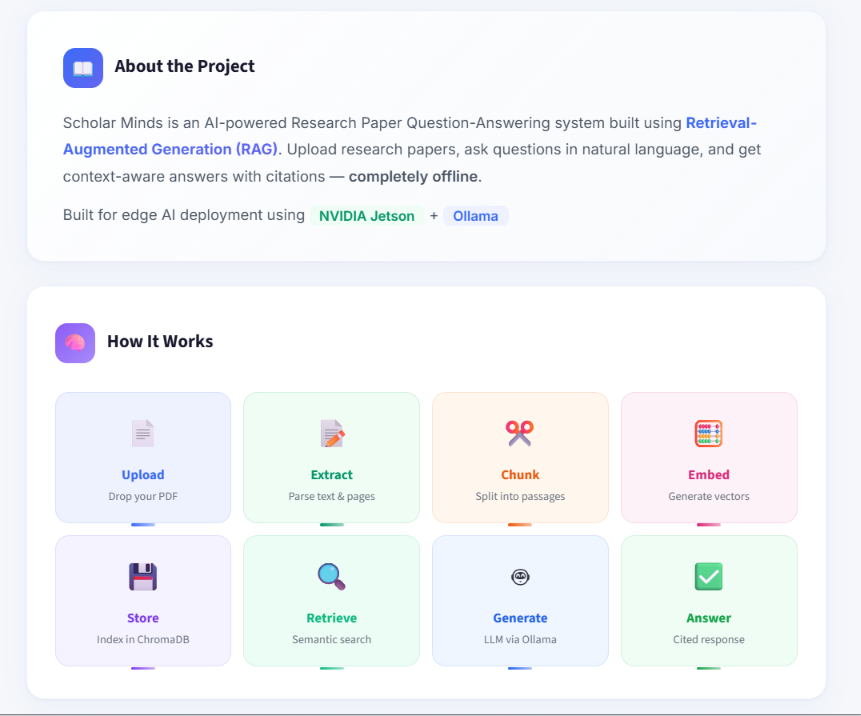

# 🎓 Scholar Minds

### Offline Research Paper Q&A using RAG on Edge Devices

[](https://www.python.org/)
[](https://streamlit.io/)
[](https://ollama.com)
[](https://www.nvidia.com/en-us/autonomous-machines/embedded-systems/)
[](LICENSE)

**Scholar Minds** is an offline AI-powered Research Paper Q&A Assistant. Built using Retrieval-Augmented Generation (RAG) principles, it allows researchers and students to upload research paper PDFs, parse them, index them into a local vector database, and query them using natural language. It generates context-aware answers with inline citations and page references—all running locally on edge hardware with zero external API calls or data leaks.

Designed and optimized for edge AI deployment using **NVIDIA Jetson** and **Ollama**.

---

## 📸 Screenshots

### 🏠 Home Page


### 📄 Upload Papers


### 📚 My Library


### 💬 Q&A Chat Interface (with Citations)


### ℹ️ About Page — Project & RAG Pipeline


---

## 🚀 Key Features

* **📄 PDF Processing on the Fly:** Seamlessly upload research papers through the Streamlit web interface or directory ingestion.
* **💬 Natural Language Q&A:** Chat with your documents using semantic search to find exact passages.
* **🔍 Semantic Retrieval-Augmented Generation (RAG):** Context is pulled from documents and passed to the LLM to prevent hallucinations.
* **📌 Citation & Page References:** Every answer is sourced with exact document names and page numbers.
* **🔒 100% Offline & Private:** Zero external internet dependencies, protecting sensitive research data.
* **⚡ Optimized for Edge Deployment:** Designed to run efficiently on resource-constrained devices like NVIDIA Jetson boards.
* **📂 Saved Chat History:** Persist conversations locally to review previous findings later.

---

## 🧠 System Architecture

```text
       ┌────────────────────────┐
       │   PDF Upload (Web UI)  │
       └───────────┬────────────┘
                   │
                   ▼
       ┌────────────────────────┐
       │  PyMuPDF Text Extractor│
       └───────────┬────────────┘
                   │
                   ▼
       ┌────────────────────────┐
       │ Recursive Text Splitter│
       └───────────┬────────────┘
                   │
                   ▼
       ┌────────────────────────┐      ┌────────────────────────┐
       │ nomic-embed-text Model │ ───> │ ChromaDB Vector Store  │
       └────────────────────────┘      └───────────┬────────────┘
                                                   │
                                                   ▼
       ┌────────────────────────┐      ┌────────────────────────┐
       │   User Query (Chat)    │ ───> │  Semantic Similarity   │
       └────────────────────────┘      └───────────┬────────────┘
                                                   │ (Retrieved Chunks)
                                                   ▼
       ┌────────────────────────┐      ┌────────────────────────┐
       │    Local LLM Inference │ <─── │ Prompt Builder         │
       │    (llama3.2:1b)       │      │ (+ Context Citations)  │
       └───────────┬────────────┘      └────────────────────────┘
                   │
                   ▼
       ┌────────────────────────┐
       │ Annotated Answer +     │
       │ Citations (Markdown)   │
       └────────────────────────┘
```

---

## 🛠️ Tech Stack

| Component | Technology | Description |
| :--- | :--- | :--- |
| **Frontend UI** | [Streamlit](https://streamlit.io/) | Premium, responsive web interface |
| **Orchestration** | [LangChain](https://www.langchain.com/) / Custom | Document loaders, splitters, and vector store integrations |
| **Vector Database**| [ChromaDB](https://www.trychroma.com/) | Local vector store for fast embedding indexing & query matching |
| **PDF Extraction** | [PyMuPDF](https://pymupdf.readthedocs.io/) | Fast PDF parser extracting text and page numbers |
| **Local LLM Engine**| [Ollama](https://ollama.com/) | Standard model runtime for local inference |
| **Inference Models**| `llama3.2:1b` (LLM) & `nomic-embed-text` (Embeddings) | Lightweight, high-accuracy models running locally on edge hardware |
| **Hardware Target**| [NVIDIA Jetson](https://www.nvidia.com/en-us/autonomous-machines/embedded-systems/) | Edge computing platform (Or standard PCs) |

---

## 📂 Project Structure

```bash
ScholarMinds/
│
├── app.py                   # CLI research report generator
├── requirements.txt         # Project dependencies
├── saved_chats.json         # Chat history persistence file
├── chroma_db/               # ChromaDB vector index directory (auto-created)
├── uploaded_papers/         # Local folder for uploaded PDFs (auto-created)
│
├── rag/                     # RAG Backend Module
│   ├── chunking.py          # Document text chunking logic
│   ├── embeddings.py        # Ollama vector embeddings manager
│   ├── generator.py         # LLM prompt templates and Ollama completions
│   ├── pdf_parser.py        # PDF extraction & parsing (PyMuPDF)
│   └── retriever.py         # ChromaDB client, indexing, and querying
│
├── ui/                      # Streamlit Frontend Module
│   └── streamlit_ui.py      # Main multi-page Streamlit dashboard app
│
└── docs/                    # Media & documentation
    └── screenshots/         # App interface screenshots
        ├── home_page.png
        ├── upload_papers.png
        ├── my_library.png
        ├── qa_page.png
        └── about_page.png
```

---

## ⚙️ Setup & Installation

### 1. Clone the Repository
```bash
git clone https://github.com/your-username/ScholarMinds.git
cd ScholarMinds
```

### 2. Set Up a Virtual Environment

#### Windows
```powershell
python -m venv venv
venv\Scripts\activate
```

#### Linux / macOS
```bash
python3 -m venv venv
source venv/bin/activate
```

### 3. Install Dependencies
```bash
pip install -r requirements.txt
```

---

## 🤖 Configuring Ollama Models

Scholar Minds uses local models running inside **Ollama**.

1. Download and install Ollama from [ollama.com](https://ollama.com).
2. Ensure Ollama service is running on your machine.
3. Pull the default language model (`llama3.2:1b`) and embedding model (`nomic-embed-text`):

```bash
ollama pull llama3.2:1b
ollama pull nomic-embed-text
```

---

## ▶️ Running the Application

### 🚀 Full Startup Procedure

Follow these steps to run the application on your device:

#### Step 1: Activate your Virtual Environment
Before starting the application, ensure your virtual environment is active:
* **Windows:**
  ```powershell
  venv\Scripts\activate
  ```
* **Linux / macOS:**
  ```bash
  source venv/bin/activate
  ```

#### Step 2: Install Project Dependencies
Ensure all required Python libraries are installed:
```bash
pip install -r requirements.txt
```

#### Step 3: Launch the Streamlit Web Application
Run the frontend dashboard using:
```bash
streamlit run ui/streamlit_ui.py
```

#### Step 4: Open in Web Browser
Upon launching, Streamlit will bind to your network and generate unique access links in your terminal:

```text
  You can now view your Streamlit app in your browser.

  Local URL:    http://localhost:8501
  Network URL:  http://192.168.1.50:8501
```

* **Local Host Access:** If you are browsing on the same device that is running the app, open:
  ```text
  http://localhost:8501
  ```
* **Remote Network Access (LAN):** If you are running the app on a dedicated host (like an NVIDIA Jetson board) and want to access the interface from another device (laptop, phone, tablet) on the same local network, open your web browser and navigate to the **Network URL** generated by your device (e.g., `http://<your-device-ip>:8501`).

### 2. Command Line Interface (CLI Report Generator)
You can also run the RAG pipeline directly from the command line to generate an exhaustive research report on any topic using documents placed inside a folder:

```bash
python app.py --topic "transformer self-attention mechanism" --papers-dir "data/sample_papers" --out "output/report.md"
```

*Arguments:*
* `--topic`: The research topic/question you want a report on.
* `--papers-dir`: Directory containing your source PDF documents.
* `--out`: Path to write the output markdown report.
* `--reset-index`: (Optional flag) Re-index all files to ChromaDB.

---

## 🧩 How the RAG Pipeline Works

1. **Extraction:** `rag/pdf_parser.py` loads PDFs page-by-page using PyMuPDF, preserving page metadata.
2. **Chunking:** `rag/chunking.py` splits the extracted text recursively, preserving logical paragraphs and overlapping chunk boundaries to retain semantic context.
3. **Embeddings:** `rag/embeddings.py` generates high-dimensional vectors for each chunk via the local `nomic-embed-text` model.
4. **Vector Store:** `rag/retriever.py` indexes the vectors into ChromaDB.
5. **Retriever:** Searches ChromaDB using cosine similarity to find top-$K$ source chunks closest to the user's question.
6. **Generator:** `rag/generator.py` constructs a context-injected prompt (with source document names and page references) and executes local inference on `llama3.2:1b` to synthesize the final markdown response.

---

## 👨‍💻 Team: Neural Ninjas

* **Shreyash Omar**
* **Aniket Sahu**
* **Priyaansh Pandey**
* **Devansh Shukla**

---

## 📜 License

This project is licensed under the MIT License. See [LICENSE](LICENSE) for details.

---

## ⭐ Acknowledgements

* [Ollama](https://ollama.com) for local LLM orchestration.
* [ChromaDB](https://trychroma.com) for the lightweight local vector store.
* [Streamlit](https://streamlit.io) for the interactive UI framework.
* [PyMuPDF](https://github.com/pymupdf/PyMuPDF) for lightning-fast PDF parsing.
* [NVIDIA Jetson](https://www.nvidia.com/en-us/autonomous-machines/embedded-systems/) for enabling edge RAG.
